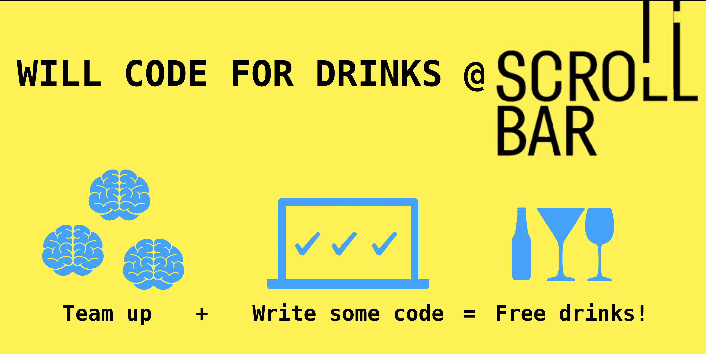

**Will Code For Drinks** is a social event hosted by [ScrollBar](https://scrollbar.dk) at [IT University of Copenhagen](https://www.itu.dk).
Teams of friends collaborate solving entertaining programming problems in return for free beverages at the bar.

With fifty teams participating, **Will Code For Drinks** is one of the largest programming events in Scandinavia.
The problems are constructed to be attractive for newcomers, the atmosphere is extremely relaxed, and participants are encouraged to help each other with problem solving, debugging, or basic programming language or computer issues.
Assistants are available and eager to help at all times during the event.
The focus is on problem solving, social interaction within and among teams, programming, confidence-building, and fun.

Unlike many similar events, **Will Code For Drinks** is not a competition---there are no prizes to win and there is no awards ceremony.

Who is this for?
----------------

The event should be entertaining and meaningful for programmers at every skill level: 
Even if you have zero confidence in your own programming ability, we promise that you’ll get at least one problem done.
On the other hand, the harder problems should be enough to keep experienced programmers busy.
Don’t expect to solve all problems; aim at two or three.

The target participants are first-year students with a few months of introductory programming under their belt, and who have never participated in something like this.
Students from outside ITU are *extremely welcome*, as are non-students. 
Some of the problems are easy enough even for Computer Science professors!

Next event
----------

The next **Will Code For Drinks** takes place 

* Friday, 29 November 2019.
* ScrollBar, IT University of Copenhagen, Rued Langgaards Vej 7, Copenhagen, Denmark.
* 15:30: Event starts. Help with registration, IT issues, etc.
* 16:00: Server opens, problems are made available at [itu.kattis.com/sessions/wcfdf2019](https://itu.kattis.com/sessions/wcfdf2019).
* 19:00: Server closes, event ends.

[Facebook Event](https://www.facebook.com/events/549759452468317/)

(No) Preparation
----------------

No formal preparation is required, you can show up at the last minute.
However:

* It’s more fun if you find some friends to team up with.
* One of you should bring a computer for programming, and you’ll need pen and paper for problem solving and collaborative thinking. Bring a charger or make sure your batteries are full.
* If you’ve never done something like this before and want to get a feeling for the type of problems appearing at the event, you can try to solve some easy problems on Open Kattis, such as [hello](https://open.kattis.com/problems/hello), [babybites](https://open.kattis.com/problems/babybites), or [guess](https://open.kattis.com/problems/guess).
This is particularly useful for learning how to read and write input and output. But don’t stress out over this beforehand – we’ll help during the event.

Details
-------

Here’s how to have the most fun:

* Bring your own laptop, which must be able to connect to the ITU wireless network, for instance via eduroam.
* One laptop per team
* Up to three people per team, three is best
* The event lasts for three hours and contains half a dozen problems. 
* One free beverage per solved problem per person, up to a maximum of three beverages per person.
* Some twenty different programming languages are accepted, including Java, Python, JavaScript, and various C dialects. 
  See the [Kattis language overview](https://open.kattis.com/help) for the full list.
* Teams must register before the event; anonymous participation is fine. Registration opens 15:30 on site.
* After solving a problem (and having it accepted on the server), immediately walk up to the bar and tell the bartender which team you are on.
* The event is hosted on ITU’s Kattis server at [itu.kattis.com/sessions/wcfdf2019](https://itu.kattis.com/sessions/wcfdf2019).

Previous events
---------------

* 23 November 2018. [Event on Open Kattis](https://open.kattis.com/contests/f4ktq9)
* 12 April 2019. [Event on Open Kattis](https://open.kattis.com/contests/fwmxyb)

